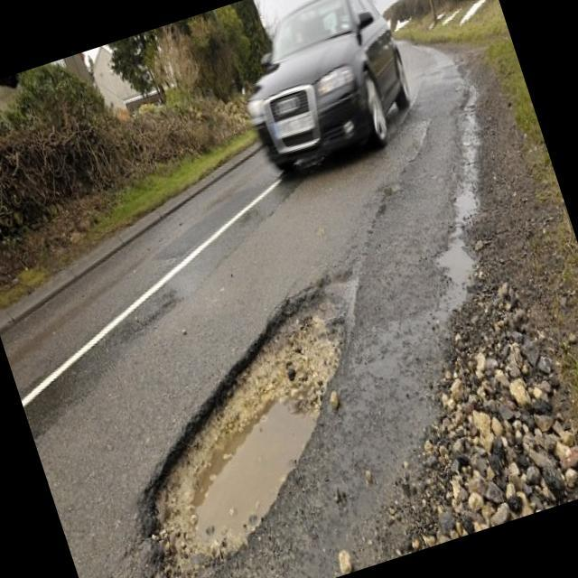
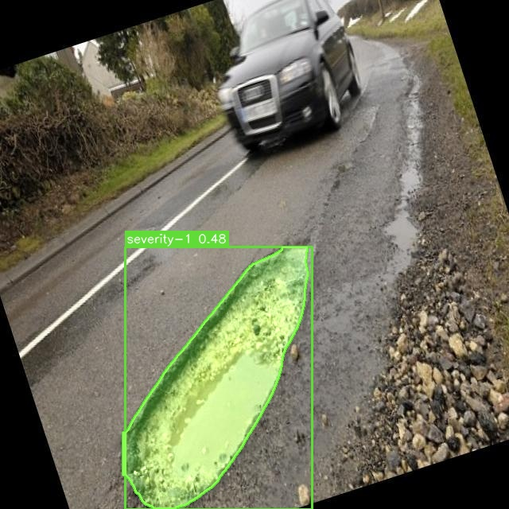

# Enhancing the Stability of Pothole Instance Segmentation in Dynamic Videos

**Author:** Bintang Darma Sakti
**Institution:** Information Technology, Telkom University Jakarta

## 📌 Overview
This repository contains the implementation of a lightweight instance segmentation model designed to detect road potholes in real-world, dynamic video streams. Traditional Object Detection models often suffer from "flickering" (intermittent detection) when faced with camera vibrations and motion blur. This project solves that issue by engineering the training data and utilizing an NMS-Free architecture.

## 🚀 Key Features & Innovations
* **Instance Segmentation over Bounding Boxes:** Upgraded from standard bounding boxes to pixel-level polygon masks to accurately capture the irregular morphology of potholes.
* **1 FPS Sequential Extraction Strategy:** Instead of training on clear, static images, the model was trained on dynamic videos extracted at 1 Frame Per Second (1 FPS). This forces the AI to learn real-world distortions like motion blur and vehicle vibrations.
* **Lightweight & NMS-Free Architecture:** Built on **YOLO26-n (Nano)**, which eliminates the Non-Maximum Suppression (NMS) bottleneck. This ensures ultra-low latency, making it highly suitable for Edge Computing deployment (e.g., Raspberry Pi) in operational survey vehicles.
* **Semi-Automated Annotation:** Leveraged Segment Anything Model 3 (SAM 3) combined with human-in-the-loop verification to ensure ground-truth polygon accuracy across 1,018 training images.

## 📊 Performance Metrics
The model deliberately trades a small percentage of mask shape accuracy (mAP) to achieve high computational speed and a maximized Recall rate—the most critical metric for road safety.

* **mAP50 (Mask):** 59.6%
* **Precision:** 56.7%
* **Recall:** 75.4% (Ensuring minimal missed detections in the field)
* **F1-Score:** 64.7%

*The model was also cross-validated using independent datasets from Mendeley Data, showing robust generalization without overfitting.*

## 🖼️ Cross-Dataset Validation Examples (Static Images)

Below are sample predictions on static images, utilizing the independent Mendeley Data dataset. This demonstrates the model's ability to generalize robustly to new, unseen data sources and various asphalt types.

| 📄 Original Image (Input) | ✅ Predicted Pothole Segmentation (Output) |
| :---: | :---: |
|  |  |
| **Source:** Sample asphalt image sourced from the Mendeley Data dataset. | **Model successfully detects and segments the irregular pothole morphology.** |

## 👁️ Visual Comparison

Below is a side-by-side comparison of the detection performance when the models are tested on dynamic real-world videos:

<table>
  <tr>
    <th align="center">❌ Run 1 (Baseline)</th>
    <th align="center">✅ Run 2 (Proposed Method)</th>
  </tr>
  <tr>
    <td><video src="Run1.mp4" controls="controls" width="100%"></video></td>
    <td><video src="Run2.mp4" controls="controls" width="100%"></video></td>
  </tr>
  <tr>
    <td><b>Model trained on static images.</b> Exhibits severe flickering and bounding box instability when facing camera vibrations.</td>
    <td><b>Model trained with 1 FPS extraction.</b> Displays highly stable, frame-to-frame polygon instance segmentation.</td>
  </tr>
</table>

## 🛠️ Tech Stack
* Python
* YOLO26-n (Ultralytics)
* Google Colab (Cloud GPU Training)
* Roboflow (Data Management & SAM 3 Annotation)

## 🗄️ Datasets & Acknowledgements
This research and implementation were made possible by utilizing the following external data sources and open-source frameworks:
* **Dynamic Video Footage:** Sourced from the GitHub repository by freedomwebtech (https://github.com/freedomwebtech/yolov8-roadpothole/blob/main/p.mp4).
* **Static Asphalt Images:** Sourced from independent road defect datasets available on Mendeley Data (https://data.mendeley.com/datasets/s5hx9n2jc3/2).
* **YOLO Architecture:** Built using the state-of-the-art vision models developed by Ultralytics (https://github.com/ultralytics/ultralytics).

*We express our gratitude to the original authors and the open-source community for making their data and frameworks publicly available.*